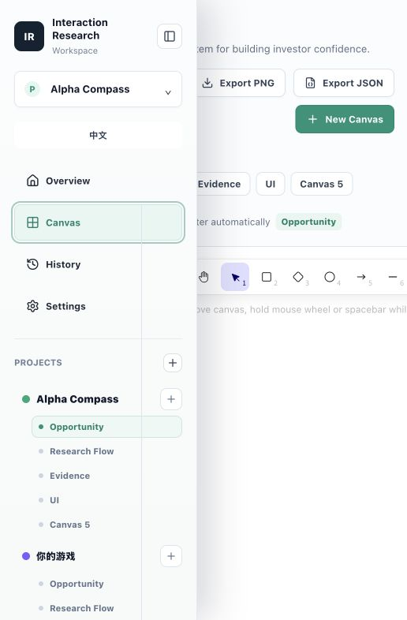
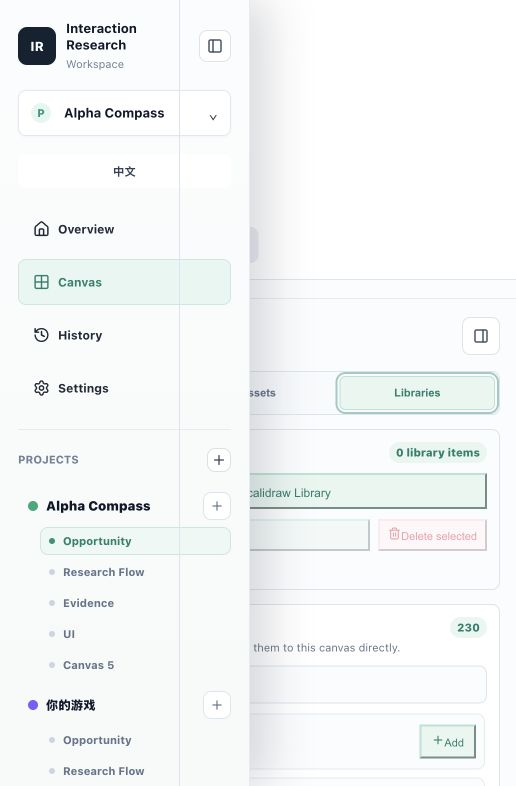

# Interaction Research Library

A local web MVP for collecting competitor UI screenshots, writing interaction analysis, and arranging reusable ideas on a canvas.

## Demo

Live site: https://interaction-research-workspace.netlify.app

GitHub Pages: https://11-lilyye.github.io/interaction-research-workspace/


## Screenshots

### Project Mission Control


[Open full-size overview screenshot](docs/media/overview.png)

### Excalidraw Canvas



### AI Partner and Libraries



## What works in this version

- Project rail with seeded research projects.
- Each project has multiple boards: Opportunity, Research Flow, Evidence, and UI.
- Screenshot upload with local image preview.
- Uploaded screenshots are inserted directly into the active project board's Excalidraw canvas.
- Editable analysis fields for task, likely next click, hierarchy, pattern, borrow, and avoid.
- One-click simulated analysis structure for uploaded or seeded assets.
- Library cards with tags and analysis status.
- Canvas mode powered by open-source Excalidraw.
- Local persistence through `localStorage`.

## Run

```bash
npm install
npm run dev
```

Open `http://127.0.0.1:5173/`.

## Build

```bash
npm run build
```

The current MVP is frontend-only. Supabase storage/data tables and real OpenAI/Gemini vision analysis can be added behind the same project, asset, analysis, and canvas data model.
