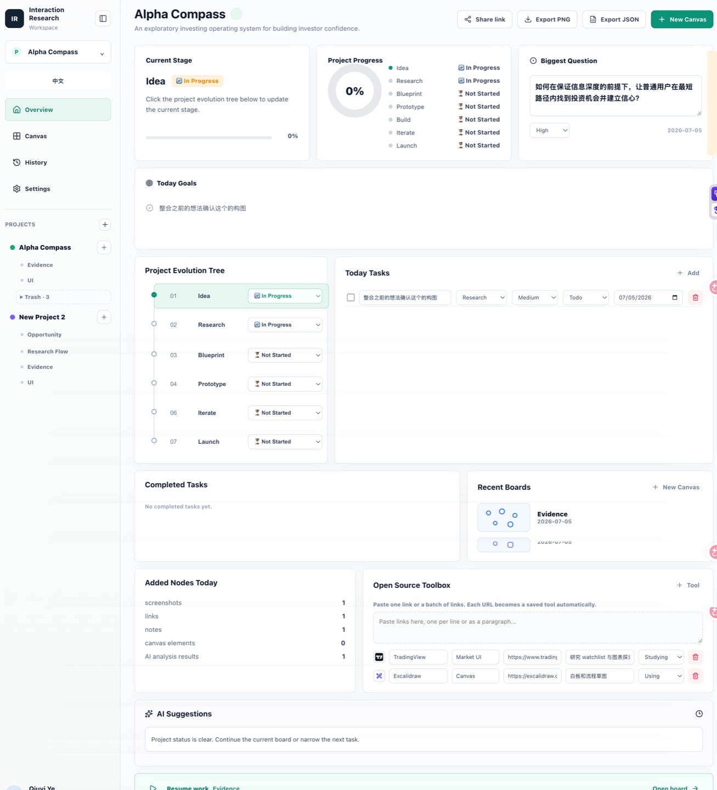

# Interaction Research Library

Interaction Research Library is a personal project studio for indie developers, product managers, and solo builders. It helps you organize product ideas, competitor UI references, research notes, canvas sketches, and project decisions in one place.

Interaction Research Library 是一个给个人开发者、产品经理、独立创作者使用的项目工作室。它用来整理项目想法、竞品 UI、研究笔记、画布草图和产品判断，不是复杂的企业项目管理系统。

The current version is frontend-only and works locally in the browser. Future versions can connect APIs for screenshot analysis, AI suggestions, project data sync, and richer research automation.

当前版本是前端本地版，数据主要保存在浏览器里。后续可以接入 API，用来做截图分析、AI 建议、项目数据同步和更自动化的研究辅助。

## Demo

Live site: https://interaction-research-workspace.netlify.app

GitHub Pages: https://11-lilyye.github.io/interaction-research-workspace/



[Watch the demo video online](https://github.com/11-lilyye/interaction-research-workspace/blob/main/docs/media/demo.mp4)

## Screenshots

### Project Mission Control


[Open full-size overview screenshot](docs/media/overview.png)

## What works in this version

- Project Mission Control: track stage, biggest question, daily tasks, completed tasks, recent boards, and open-source tools.
- 项目状态页：管理项目阶段、当前最大问题、今日任务、已完成任务、最近画布和开源工具箱。
- Canvas workspace: draw interaction flows with an Excalidraw-powered infinite canvas.
- 画布工作区：基于 Excalidraw 的无限画布，用来画交互流程、结构图和产品思路。
- Boards under each project: create different boards for research, evidence, UI, flows, or any custom topic.
- 每个项目可以有多个 Board：比如研究、证据、UI、流程，也可以自己添加。
- Assets and Libraries: keep screenshots, links, and external Excalidraw libraries close to the canvas.
- 资产与素材库：截图、链接、外部 Excalidraw 素材都可以围绕当前画布使用。
- AI Partner panel: first version uses local mock analysis; later it can connect to real APIs.
- AI 伙伴面板：第一版先做本地模拟分析，后续可以接真实 API。
- Local persistence through `localStorage`.
- 当前数据保存在浏览器本地 `localStorage`。

## Who it is for

- Indie developers exploring a new product or game level.
- Product managers collecting UI patterns and research evidence.
- Solo builders turning screenshots, notes, and ideas into a concrete interaction plan.
- 适合个人开发者、产品经理、独立创作者，用来把截图、笔记和灵感整理成可以继续推进的项目方案。

## API roadmap

Later API integrations can support:

- Vision analysis for screenshots and UI references.
- URL capture and automatic naming for saved assets.
- AI-generated research summaries, design conflicts, task suggestions, and Codex prompts.
- Cloud sync with a database such as Supabase.
- Team sharing, read-only links, and persistent project data.

后续 API 接入可以支持：

- 截图和 UI 参考的视觉分析。
- 链接抓取、自动命名和资产归档。
- AI 生成研究总结、设计冲突、任务建议和 Codex Prompt。
- 通过 Supabase 等数据库做云端同步。
- 团队共享、只读链接和长期项目数据保存。

## Local Development / 本地开发

These commands are only for developers who want to run or modify the project on their own computer. If you only want to use the online demo, open the live site above.

下面这些命令只给想在自己电脑运行或修改代码的开发者使用。如果只是体验在线版本，直接打开上面的 Live site 就可以。

```bash
npm install
npm run dev
```

Then open `http://127.0.0.1:5173/`.

然后打开 `http://127.0.0.1:5173/`。

## Production Build / 部署构建

This command checks the code and creates the static files used by Netlify or GitHub Pages.

这个命令会检查代码，并生成 Netlify 或 GitHub Pages 用来部署的静态网页文件。

```bash
npm run build
```

This is still an early personal studio MVP. The goal is to stay simple first: collect references, think clearly, draw the product flow, then add API assistance when the workflow is stable.

这仍然是早期个人工作室 MVP。目标是先保持简单：收集参考、整理判断、画出产品流程；等工作流稳定后，再接入 API 做辅助分析。
